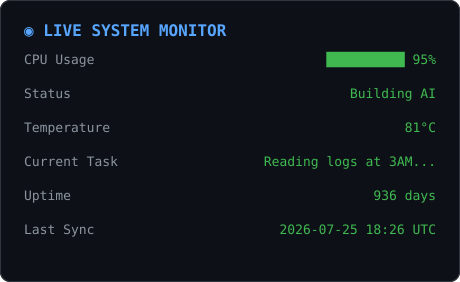

<!--
╔══════════════════════════════════════════════════════════════════════╗
║  DEV OS 4.1 — GitHub Profile                                          ║
║  You found the source. Nice. Keep digging, there's more below.       ║
║  → HINT #1: Base64 says "aW5zcGVjdF9tb3Jl"                            ║
╚══════════════════════════════════════════════════════════════════════╝
-->

<!-- ====================== BOOT SEQUENCE ====================== -->
<a id="boot"></a>

<div align="center">

# ⚡ DEV OS 4.1

```
Powering on...  █▒▒▒▒▒▒▒▒▒ 10%
Loading kernel..████▒▒▒▒▒▒ 45%
Initializing AI █████████▒ 96%
```

**System Ready.** — click below to boot in.

</div>

<div align="center">

<!-- The ONLY thing open at start. Everything else is hidden until clicked. -->

<details>
<summary><h3>▶ &nbsp; Press ENTER to log in</h3></summary>

<br>

```
┌─────────────────────────────────────┐
│           Authentication            │
├─────────────────────────────────────┤
│ Username: visitor                   │
│ Password: ********                  │
│ ✔ Login Successful                  │
└─────────────────────────────────────┘
```

<!-- Nested: only appears AFTER you open login -->

<details>
<summary><b>▶ &nbsp; Continue to terminal →</b></summary>

<br>

```
visitor@github:~$ _
```

Type a command below by **clicking it open**. Each one runs like a real shell.

<table align="left"><tr><td>

<!-- ================= COMMAND: help ================= -->
<details>
<summary><code>$ help</code></summary>

```
Available Commands
──────────────────
about        Print bio
projects     List featured repositories
skills       Show tech stack
stats        Render GitHub statistics
quests       Current missions & objectives
labs         Live system monitor
inventory    Equipped tools (RPG style)
map          Filesystem navigation
chat         Talk to ChatGPT OS
bios         Phoenix Developer BIOS
contact      How to reach me
sudo hire-me Elevated privileges required
```

</details>

<!-- ================= COMMAND: about ================= -->
<details>
<summary><code>$ about</code></summary>

<br>

```
visitor@github:~$ cat about/whoami.txt
```

> **your_username** — Software Engineer · AI Developer
> I build autonomous agents, compilers, and things that shouldn't
> work at 3 AM but somehow do. Powered by Rust, Python, and coffee.

```
Location : /dev/earth
Shell    : zsh + too many aliases
Status   : compiling...
```

</details>

<!-- ================= COMMAND: map ================= -->
<details>
<summary><code>$ map</code></summary>

<br>

```
/
├── about/
├── projects/
│   ├── ai-agent
│   ├── compiler
│   └── robotics
├── labs/
├── achievements/
├── secret/
└── contact.txt
```

Click a folder to open it:

<details><summary>📂 <code>projects/</code></summary>

<blockquote>

<details><summary>⭐ <code>ai-agent</code></summary>

Autonomous coding agent — planning, memory, tool use. The flagship.

</details>

<details><summary>⚙️ <code>compiler</code></summary>

A language that compiles (mostly). Lexer → parser → codegen, in Rust.

</details>

<details><summary>🤖 <code>robotics</code></summary>

Real-time control loops meet machine learning.

</details>

</blockquote>
</details>

<details><summary>📂 <code>secret/</code></summary>

<blockquote>

Access denied.

<details><summary>🔓 <code>sudo unlock</code></summary>

```
404
You weren't supposed to find this.
```
Morse: `.... .. .-. . / -- .`  ·  Base64: `V2VsbCBkb25lLg==`

</details>

</blockquote>
</details>

</details>

<!-- ================= COMMAND: projects ================= -->
<details>
<summary><code>$ projects</code></summary>

<br>

```
visitor@github:~$ devpkg search ai

Searching...
✓ ai-agent
✓ llm-tools
✓ neural-utils
✓ compiler-core

Install? [y/n]
```

<details><summary><code>y</code> — install featured project</summary>

<br>

**ai-agent** installing... `██████████ 100%` ✔ done.
→ https://github.com/your_username/ai-agent

</details>

</details>

<!-- ================= COMMAND: skills ================= -->
<details>
<summary><code>$ skills</code></summary>

<br>


</details>

<!-- ================= COMMAND: inventory ================= -->
<details>
<summary><code>$ inventory</code></summary>

<br>

```
INVENTORY                       WEIGHT 38/100
─────────────────────────────  ██████░░░░░░░░
⚔  Rust        [equipped]  +12 systems
🧠 Python      [equipped]  +10 intelligence
🛡  Docker      [equipped]  +6  defense
✨ Kubernetes  [equipped]  +6  orchestration
📦 React       [equipped]  +2  frontend
🔮 AI          [equipped]  +2  foresight
```

</details>

<!-- ================= COMMAND: quests ================= -->
<details>
<summary><code>$ quests</code></summary>

<br>

```
╔═══════════ CHARACTER ═══════════╗
║ Name    : your_username         ║
║ Class   : Software Engineer     ║
║ Subclass: AI Developer          ║
║ Level   : 37                    ║
║ XP      : ██████████████░░ 82%  ║
╠═══════════ BOSSES ══════════════╣
║ ☑ JavaScript                    ║
║ ☑ Memory Leaks                  ║
║ ☑ Production Outages            ║
║ ☐ Burnout                       ║
╚═════════════════════════════════╝
```

<details><summary>▶ current mission</summary>

```
╔════════ CURRENT MISSION ════════╗
║ > Build autonomous coding agent ║
╠══════════ OBJECTIVES ═══════════╣
║ ☑ Authentication                ║
║ ☑ Planning                      ║
║ ☐ Memory                        ║
║ ☐ Vision                        ║
║ ☐ Voice                         ║
╚═════════════════════════════════╝
```
Auto-updates via `.github/workflows/live-stats.yml`.

</details>

</details>

<!-- ================= COMMAND: stats ================= -->
<details>
<summary><code>$ stats</code></summary>

<br>


<br>


</details>

<!-- ================= COMMAND: labs ================= -->
<details>
<summary><code>$ labs</code> — live monitor</summary>

<br>

> Regenerated hourly by GitHub Actions. Not static text.



</details>

<!-- ================= COMMAND: chat ================= -->
<details>
<summary><code>$ chat</code> — ChatGPT OS</summary>

<br>

```
> Ask me something.
```

<details><summary>1 · Who are you?</summary>

An engineer who automates the boring parts and over-engineers the fun ones.

</details>

<details><summary>2 · Favorite project?</summary>

`ai-agent`. It writes code so I can write more agents.

</details>

<details><summary>3 · Why should I hire you?</summary>

Ships fast, breaks little, fixes faster. Try `sudo hire-me`.

</details>

</details>

<!-- ================= COMMAND: bios ================= -->
<details>
<summary><code>$ bios</code></summary>

<br>

```
PHOENIX DEVELOPER BIOS v4.1
───────────────────────────
CPU     ██████████ 100%
RAM     ██████████ 100%
Coffee  ██████████ 100%
Sleep   ██░░░░░░░░  20%
Humor   ██████████ 100%
───────────────────────────
Press DEL for settings.
```

</details>

<!-- ================= COMMAND: achievements ================= -->
<details>
<summary><code>$ achievements</code></summary>

<br>

```
🏆 100 Stars
🏆 First OSS Contribution
🏆 AI Project Released
🔒 Secret Achievement
```

<details><summary>🔒 unlock secret achievement</summary>

```
404 — You weren't supposed to find this.
```
Base64: `aW5zcGVjdF9tb3Jl` · check the commit history for the real one.

</details>

</details>

<!-- ================= COMMAND: contact ================= -->
<details>
<summary><code>$ contact</code></summary>

<br>

```
visitor@github:~$ cat contact.txt
```

[](mailto:you@example.com)
[](https://linkedin.com/in/your_username)
[](https://your-site.dev)

</details>

<!-- ================= COMMAND: sudo hire-me ================= -->
<details>
<summary><code>$ sudo hire-me</code></summary>

<br>

```
[sudo] password for visitor: ********
✔ Access granted. Loading résumé...
```

- 🚀 Ships fast, breaks little, fixes faster
- 🧠 Deep in AI agents, compilers, distributed systems
- 🤝 Turns "impossible by Friday" into "done Thursday"

</details>

<!-- ================= COMMAND: exit ================= -->
<details>
<summary><code>$ exit</code></summary>

```
logout
Connection to github closed.
```
<a href="#boot">▲ reboot</a>

</details>

</td></tr></table>

</details>
</details>
</details>

<sub>Built with ASCII, <code>&lt;details&gt;</code>, and questionable life choices.</sub>

</div>

<!--
QR / MORSE / BASE64 STASH (for source-divers):
  MORSE : .... .. .-. . / -- . = "HIRE ME"
  BASE64: aW5zcGVjdF9tb3Jl = "inspect_more"
  BASE64: V2VsbCBkb25lLg== = "Well done."
  NEXT  : check the repo's commit messages for coordinates.
-->
